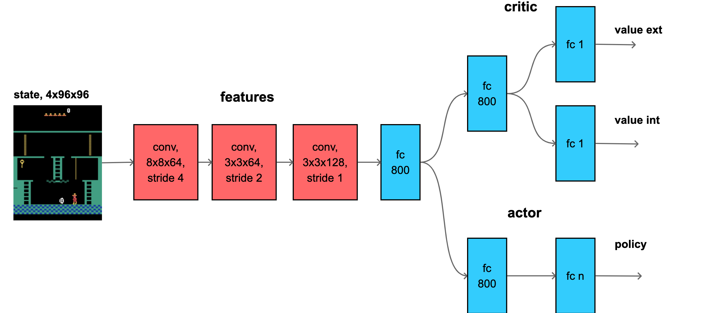

# intrinsic motivation experiments

# dependences

```bash
pip3 install numpy matplotlib sklearn, torch opencv-python, Pillow, pyglet
```

for RTX3x GPUS : 
```bash
pip3 install torch==1.11.0+cu113 --extra-index-url https://download.pytorch.org/whl/cu113
```

# gym environments install

```bash
pip3 install 'gym[atari, accept-rom-license]==0.21'
pip3 install pybullet
pip3 install procgen
```

# random network distillation

**main idea** two models, one random, second trained to imitate first, difference is motivation (internal reward)

paper [Exploration by Random Network Distillation](https://arxiv.org/abs/1810.12894)


# my idea : siamese network distillery 

**main idea** target RND model should be learned too, to achieve metrics-like properties
and provide stronger motivation signal, without vanihsing during training


- projection of RND features sapace into 2D (512 dims to 2 dims using t-sne)
- colors represent different rooms in Montezuma's Revenge environment
- the common RND (random orthogonal init), provides isoladed islands, where in-rooms states are tightly grouped


- siamese distiller spread features not only across different rooms, but also in-room itself


- this agent was able to discover 15rooms (vs 9), and achieves bigger score


- as contrastive loss, common L2 MSE was used, where close states were labeled with 0, and different states labeled with 1


# key points

## generic bullet points
- input into all experiments is **4x96x96**
- state is divided by 256, to provide values in $$ s \in \langle 0, 1) $$
- for RND, **only mean** have to be substrated from state, dividing by std causes huge unstability
- internal motivation **is not divided by it's std** - it can be, but I don't observed improvement (yet)
- advantages **are not notmalised** by mean or std
- two heads for critic used, ValueInt and ValueExt

## hyperparameters

- two gammas used
    $$ gamma_{ext} = 0.998 $$
    $$ gamma_{int} = 0.99 $$
- 128 paralel envs
- 128 PPO steps
- 4 training epochs
- entropy regularisation 0.001
- learning rate is set to 0.0001, but loss for critic is scaled by 0.5
- **MSE loss for RND is regularised**, by keeping random 25% elements non zero (for 128 envs, 100% for 32envs), this effecitively slow down RND learning and provides internal motivation in usefull range
- advantages scaling is
    $$ ext\_adv = 2.0 $$
    $$ int\_adv = 1.0 $$
- PPO clip set to 0.1
- gradient clip set to 0.5        


## Results
RND baseline               |  SND                      | SND + entropy            :
:-------------------------:|:-------------------------:|:-------------------------:
  |   |  


## RND model

- for RND model use ELU activation (ReLU or leaky ReLU doesn't works)
- for RND model use orthogonal weight init (sqrt(2)), to provide sufficient amplitude output
- **RND motivation** is computed as sum of features / 2, not as mean
$$reward_{int} = sum(RNDfeatures_{target} - RNDfeatures_{pred}, dim=1)/2 $$

## PPO model
- both, 8x8 or 3x3 kernels on first layer seems to be working
- after 3..4 conv layers, the **aditional FC hidden layer** is required for features (512 .. 800units)
- actor and critic have another hidden layer (512 .. 800units)
- features backbone **weight init** is best orthogonal sqrt(2)
- policy (actor) **weight init** is best 
orthogonal 0.01
- critic  **weight init** is best 
orthogonal 0.1 for hidden and 0.01 for output


## model details

### model RND

- input is single frame, 1x96x96
- 3 conv layers
- trained model need to be deeper (3fc layers)
- ELU activations performs best
- to avoid "almost zero" output, both model uses orthogonal weight init, sqrt(2), and zero bias

 

### model PPO

- input is four frames, 4x96x96 or 12x96x96
- 3 .. 4 conv layers
- separated critic heads for internal and external motivation - internal motivation is non-stationary

- need few fc layers for features head, otherwise agent learns only pure policy

- ReLU ativations performs best
- for features, orthogonal init sqrt(2)
- all models with zero initial bias

## model A


## model B


## model C


## model D


# parameters

|name       | model architecture | normalise int reward  |critic hidden init range |
|-----------|--------------------|-----------------------|-------------------------|
|ppo_rnd_a0 | A                  |false                  |0.1                      |
|ppo_rnd_b0 | B                  |false                  |0.1                      |
|ppo_rnd_b1 | B                  |false                  |sqrt(2)                  |
|ppo_rnd_b2 | B                  |true                   |0.1                      |
|ppo_rnd_b3 | B                  |true                   |sqrt(2)                  |
|ppo_rnd_c0 | C                  |false                  |0.1                      |
|ppo_rnd_c1 | C                  |false                  |sqrt(2)                  |
|ppo_rnd_d0 | D                  |false                  |0.1                      |


# montezuma revenge RND results


## model A result

### ppo_rnd_a0 results

**model [ppo_rnd_a0](experiments/atari_hard/montezuma_revenge/models/ppo_rnd_a_0/)**


## model B result

### ppo_rnd_b0 results

**model [ppo_rnd_b0](experiments/atari_hard/montezuma_revenge/models/ppo_rnd_b_0/)**


### ppo_rnd_b1 results

**model [ppo_rnd_b1](experiments/atari_hard/montezuma_revenge/models/ppo_rnd_b_1/)**


### ppo_rnd_b2 results

**model [ppo_rnd_b2](experiments/atari_hard/montezuma_revenge/models/ppo_rnd_b_2/)**


### ppo_rnd_b3 results

**model [ppo_rnd_b3](experiments/atari_hard/montezuma_revenge/models/ppo_rnd_b_3/)**


## model C result

### ppo_rnd_c0 results

**model [ppo_rnd_c0](experiments/atari_hard/montezuma_revenge/models/ppo_rnd_c_0/)**


### ppo_rnd_c1 results

**model [ppo_rnd_c1](experiments/atari_hard/montezuma_revenge/models/ppo_rnd_c_1/)**


## model D result

### ppo_rnd_d0 results

**model [ppo_rnd_d0](experiments/atari_hard/montezuma_revenge/models/ppo_rnd_d_0/)**


# montezuma revenge SND results

- agent is able to achieve score 10 000+
- explore 14..16rooms
- this score is achieved on 100x less samples than for RND


## model C result

### ppo_snd_c_0 results

**model [ppo_snd_c_0](experiments/atari_hard/montezuma_revenge/models/ppo_snd_c_0/)**


### ppo_snd_c_3 results

**model [ppo_snd_c_3](experiments/atari_hard/montezuma_revenge/models/ppo_snd_c_3/)**


### ppo_snd_c_4 results

**model [ppo_snd_c_4](experiments/atari_hard/montezuma_revenge/models/ppo_snd_c_4/)**


# gravitar


 


# venture


 


# pitfall


 


# breakout - WITHOUT external rewards 


 


# pacman - WITHOUT external rewards 


 


 
# dependences
cmake python3 python3-pip

**basic python libs** 
pip3 install numpy matplotlib torch torchviz pillow opencv-python networkx

**environments**
pip3 install  gym pybullet pybulletgym 'gym[atari]' 'gym[box2d]' gym-super-mario-bros gym_2048

**my RLAgents** [github : RLAgents](https://github.com/michalnand/reinforcement_learning_agents)
