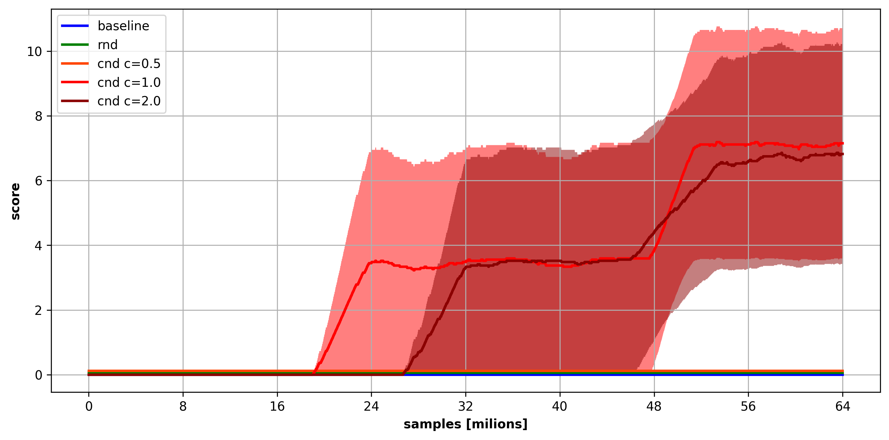
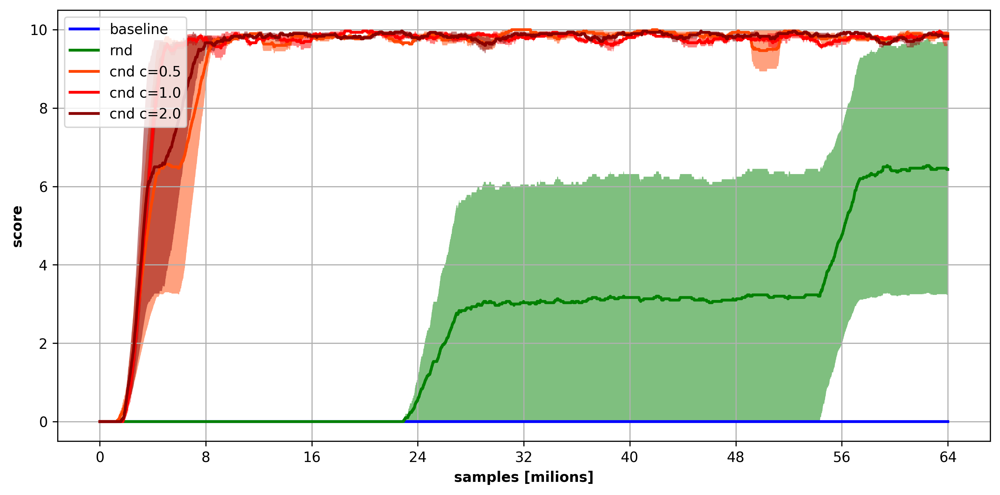

# procgen - solving hard seeds

there are hard exploration seeds in original procgen

source [Leveraging Procedural Generation to Benchmark Reinforcement Learning](https://arxiv.org/pdf/1912.01588.pdf)

see. section **B.1. Evaluating Exploration** for more details

this seeds are **unable to solve** with baseline PPO (or RND) in 200M samples, but CND
solve them in just 64M samples

# 4 tested procgen envs

## caveflyer climber coinrun jumper

 
# results

## caveflyer

 

## climber

## coinrun

## jumper

